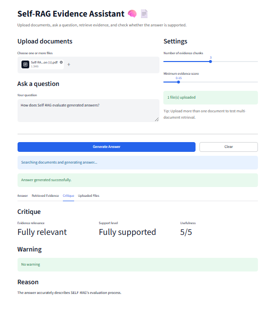

# Self-RAG Evidence Assistant

A simple Streamlit app inspired by the Self-RAG paper.

In this project, the user can upload documents, ask a question, and get an answer based on the retrieved evidence. The app also checks whether the answer is supported by the evidence.

This is not a full implementation of the original Self-RAG model. It is a small practical project to understand the main ideas behind Self-RAG, especially retrieval, critique, and reflection.

---

## Project Idea

Traditional RAG systems usually retrieve relevant text and then generate an answer from it.

Self-RAG adds a reflection step. The model does not only generate an answer, but also checks whether retrieval was useful and whether the answer is supported by the evidence.

I used this idea in a simplified way. In this project, the app retrieves relevant chunks from uploaded documents, generates an answer, critiques the answer, and shows a short reflection summary.

---

## How the App Works

The app follows this process:

```text
Upload documents
↓
Extract text from PDF, TXT, or DOCX files
↓
Split the text into chunks
↓
Create embeddings
↓
Retrieve the most relevant chunks
↓
Generate an answer
↓
Critique the answer
↓
Show a reflection summary
```

---

## Demo

Here is a screenshot of the app after uploading the Self-RAG paper and asking a question.



---

## Features

* Upload PDF, TXT, and DOCX files
* Ask questions about uploaded documents
* Retrieve relevant evidence chunks
* Generate an answer using Groq API
* Check whether the answer is supported by the retrieved evidence
* Show critique results
* Show a simple Self-RAG-style reflection summary
* Show evidence quality based on the best retrieved similarity score
* Download the result as a TXT file

---

## Self-RAG Ideas Used in This Project

| Self-RAG idea         | How I used it in this project                                                      |
| --------------------- | ---------------------------------------------------------------------------------- |
| Retrieval             | The app finds relevant chunks from uploaded documents                              |
| Critique              | The app checks whether the answer is supported by evidence                         |
| Reflection            | The app shows a summary of retrieval decision, evidence quality, and support level |
| Evidence-based answer | The answer is generated only from retrieved evidence                               |

---

## Project Structure

```text
self-rag-evidence-assistant/
│
├── app.py
├── README.md
├── requirements.txt
├── .env.example
│
├── src/
│   ├── file_loader.py
│   ├── chunker.py
│   ├── embedder.py
│   ├── retriever.py
│   ├── generator.py
│   ├── critic.py
│   ├── reflection.py
│   └── pipeline.py
│
├── examples/
│   └── example_outputs.md
│
├── notes/
│   ├── paper_summary.md
│   ├── traditional_rag.md
│   ├── self_rag.md
│   └── key_concepts.md
│
└── assets/
    └── demo.png
```

---

## Tech Stack

* Python
* Streamlit
* Groq API
* Sentence Transformers
* Scikit-learn
* PyPDF
* python-docx
* NumPy
* python-dotenv

---

## Installation

Clone the repository:

```bash
git clone https://github.com/fatsed/self-rag-evidence-assistant.git
cd self-rag-evidence-assistant
```

Create a virtual environment:

```bash
python -m venv .venv
```

Activate it on Windows:

```bash
.venv\Scripts\activate
```

Install the requirements:

```bash
pip install -r requirements.txt
```

---

## Environment Variables

This project uses Groq API for answer generation and critique.

Create a `.env` file in the project folder and add your API key:

```env
GROQ_API_KEY=your_groq_api_key_here
```

There is also a sample file:

```text
.env.example
```

---

## How to Run

Run the app with:

```bash
streamlit run app.py
```

Then open the local link shown in the terminal.

---

## Example Output

A sample output is available in:

```text
examples/example_outputs.md
```

It includes a sample question, generated answer, retrieved evidence, critique result, and reflection summary.

---

## Notes

I also added short notes while studying the paper:

* [Self-RAG Paper Summary](notes/paper_summary.md)
* [Traditional RAG](notes/traditional_rag.md)
* [Self-RAG](notes/self_rag.md)
* [Key Concepts](notes/key_concepts.md)

---

## Important Note

This project is not a full reproduction of the Self-RAG paper.

The original Self-RAG method trains a language model to use reflection tokens during generation. My project only simulates the main workflow in a simpler way using retrieval, generation, critique, and a reflection summary.

---

## Why I Built This

I built this project because I wanted to understand Self-RAG better by turning the idea into a small working app.

Instead of only reading the paper, I wanted to make something practical where I could upload documents, ask questions, retrieve evidence, and check if the answer is supported.

---

## Reference

Paper: Self-RAG: Learning to Retrieve, Generate, and Critique through Self-Reflection
Official repository: https://github.com/akariasai/self-rag

---
## Status

MVP completed.

For now, the main workflow is complete. Future improvements may include deployment, better retrieval settings, and more evaluation options.