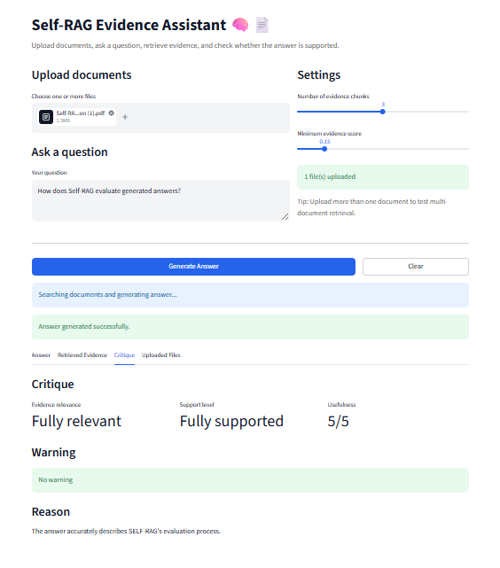

# Self-RAG Evidence Assistant

A document question-answering assistant inspired by the Self-RAG paper.

Users can upload documents, ask questions, retrieve relevant evidence, generate an answer, and evaluate whether the answer is supported by the retrieved content.

This project is not a full reproduction of the original Self-RAG model. It implements the main Self-RAG ideas as a runtime workflow without training a new language model.

## Project Overview

Traditional Retrieval-Augmented Generation systems retrieve relevant text and use it to generate an answer.

Self-RAG introduces a more reflective process by deciding whether retrieval is needed, evaluating retrieved evidence, checking whether the generated answer is supported, and revising the answer when necessary.

This project implements a simplified version of that workflow:

```text
Upload documents
↓
Extract text from PDF, TXT, or DOCX files
↓
Split the text into chunks
↓
Create embeddings
↓
Decide whether retrieval is needed
↓
Retrieve relevant evidence
↓
Evaluate each evidence chunk
↓
Generate an evidence-based answer
↓
Critique the answer
↓
Revise the answer when needed
↓
Generate a reflection summary
```

## Features

- Upload PDF, TXT, and DOCX documents
- Ask questions about uploaded documents
- Retrieve semantically relevant text chunks
- Decide whether retrieval is needed
- Evaluate retrieved evidence with an LLM
- Label evidence as Relevant, Partially relevant, or Irrelevant
- Generate answers using the Groq API
- Check whether answers are supported by evidence
- Revise partially supported or unsupported answers
- Display evidence scores and critique results
- Generate a Self-RAG-style reflection summary
- Download results as a TXT file
- Use the project through a Streamlit interface
- Access the pipeline through a FastAPI backend

## Demo

The following screenshot shows the application after uploading the Self-RAG paper and asking a question:



## Self-RAG Concepts

| Self-RAG concept | Implementation in this project |
|---|---|
| Retrieval decision | Determines whether document retrieval is required |
| Retrieval | Finds relevant chunks from uploaded documents |
| Evidence critique | Evaluates each retrieved chunk |
| Answer generation | Generates an answer using retrieved evidence |
| Answer critique | Checks whether the answer is supported |
| Answer revision | Revises answers that are not fully supported |
| Reflection | Summarizes retrieval, evidence quality, support, and warnings |

## Project Structure

```text
self-rag-evidence-assistant/
├── app.py
├── api.py
├── download_model.py
├── README.md
├── requirements.txt
├── .env.example
├── .gitignore
├── LICENSE
├── CONTRIBUTING.md
├── src/
│   ├── config.py
│   ├── file_loader.py
│   ├── chunker.py
│   ├── embedder.py
│   ├── retriever.py
│   ├── evidence_critic.py
│   ├── generator.py
│   ├── critic.py
│   ├── reviser.py
│   ├── reflection.py
│   └── pipeline.py
├── examples/
│   └── example_outputs.md
├── notes/
│   ├── paper_summary.md
│   ├── traditional_rag.md
│   ├── self_rag.md
│   └── key_concepts.md
└── assets/
    └── demo.png
```

## Technologies

- Python
- Streamlit
- FastAPI
- Uvicorn
- Groq API
- Sentence Transformers
- Scikit-learn
- PyPDF
- python-docx
- python-multipart
- NumPy
- python-dotenv

## Installation

Clone the repository:

```bash
git clone https://github.com/fatsed/self-rag-evidence-assistant.git
cd self-rag-evidence-assistant
```

Create a virtual environment:

```bash
python -m venv .venv
```

Activate it on Linux or macOS:

```bash
source .venv/bin/activate
```

Activate it on Windows:

```bash
.venv\Scripts\activate
```

Install the required packages:

```bash
pip install -r requirements.txt
```

## Environment Variables

The project uses the Groq API for answer generation, evidence evaluation, answer critique, and answer revision.

Create a `.env` file in the project directory:

```env
GROQ_API_KEY=your_groq_api_key_here
```

A sample configuration is available in:

```text
.env.example
```

Do not commit your real API key to the repository.

## Running the Streamlit Interface

Start the Streamlit application with:

```bash
streamlit run app.py
```

Open the local address displayed in the terminal, usually:

```text
http://localhost:8501
```

## Running the FastAPI Backend

Start the FastAPI server with:

```bash
uvicorn api:app --reload
```

The API will be available at:

```text
http://127.0.0.1:8000
```

Interactive Swagger documentation:

```text
http://127.0.0.1:8000/docs
```

Alternative API documentation:

```text
http://127.0.0.1:8000/redoc
```

## API Endpoints

### Health Check

```http
GET /health
```

Returns the current API status.

### Ask a Question

```http
POST /ask
```

Accepts a JSON request containing:

```json
{
  "question": "What is Self-RAG?",
  "top_k": 3,
  "min_score": 0.25
}
```

### Ask a Question with a File

```http
POST /ask-file
```

Accepts a document upload together with:

- `question`
- `top_k`
- `min_score`
- `file`

Supported file types include PDF, TXT, and DOCX.

## Example Output

A sample output is available at:

```text
examples/example_outputs.md
```

It includes:

- A sample question
- The generated answer
- Retrieved evidence
- Evidence critique
- Answer critique
- Reflection summary

## Study Notes

The repository also contains notes created while studying the Self-RAG paper:

- [Self-RAG Paper Summary](notes/paper_summary.md)
- [Traditional RAG](notes/traditional_rag.md)
- [Self-RAG](notes/self_rag.md)
- [Key Concepts](notes/key_concepts.md)

## Limitations

This project is a Self-RAG-inspired educational implementation rather than an exact reproduction of the original method.

The original Self-RAG approach trains a language model to produce reflection tokens during generation. This project does not train a new model. Instead, retrieval decision, evidence critique, answer critique, revision, and reflection are performed as separate runtime steps.

Other limitations include:

- Results depend on the quality of uploaded documents.
- Retrieval settings may require adjustment for different document types.
- LLM-generated critiques may not always be consistent.
- The project does not currently include a formal evaluation dataset.
- The system should not be used for high-stakes decisions without human review.

## Why This Project Was Built

This project was created to understand Self-RAG through practical implementation.

Instead of only studying the paper, the goal was to build a working system that retrieves evidence, generates answers, evaluates support, revises weak answers, and displays the reasoning workflow in an understandable interface.

## Status

MVP completed.

The current version includes document upload, semantic retrieval, LLM-based evidence critique, answer generation, answer critique, answer revision, reflection summaries, a Streamlit interface, and a FastAPI backend.

## Future Improvements

- Deploy a public demo
- Improve retrieval configuration
- Add automated evaluation
- Add a test dataset for evidence critique
- Add unit and integration tests
- Support additional document formats
- Improve API validation and error responses

## Reference

Self-RAG: Learning to Retrieve, Generate, and Critique through Self-Reflection

- Paper: https://arxiv.org/abs/2310.11511
- Official repository: https://github.com/akariasai/self-rag

## License

This project is licensed under the [MIT License](LICENSE).
